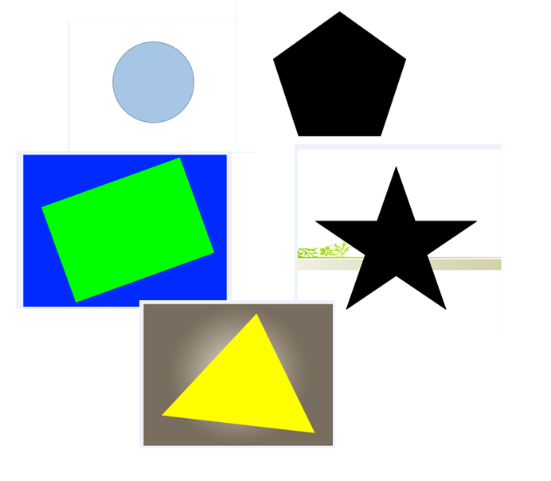
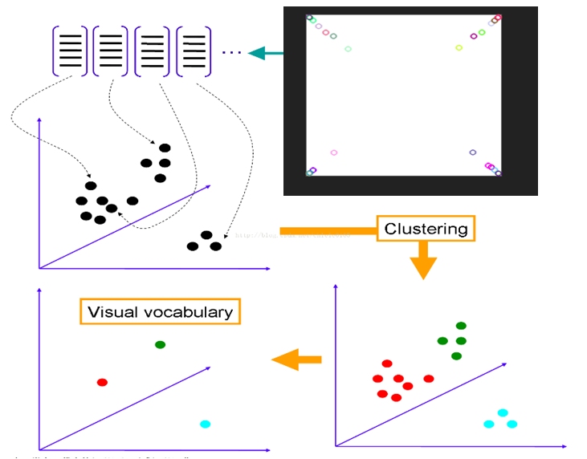
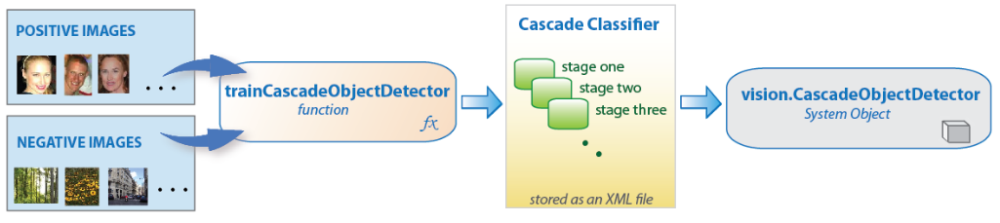
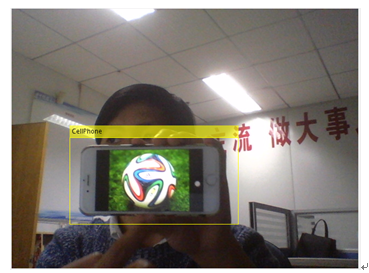
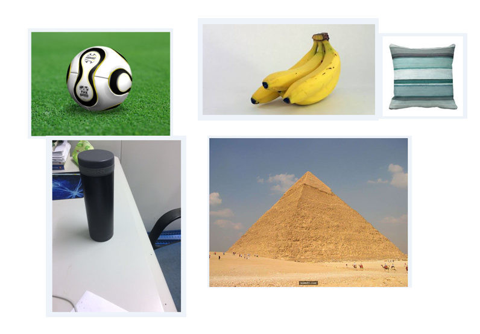
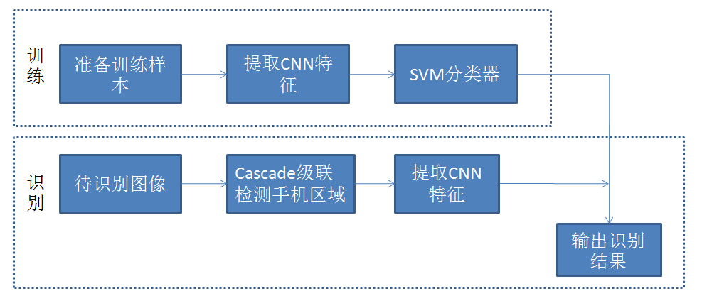

## 王润 邓信 程驰 袁振威 黎文盛  

### Week1 
* **选定题目**   
在对比了5个题目，队员结合自己对题目的熟悉程度后，选定做 2D and 3D Shape Recognition。  
* **建立项目网站**  
利用GitHub Pages，可以利用markdown来进行编写，比较方便。  
* **查找资料**  
文献：  
[1] Chang et al., ShapeNet: An Information-Rich 3D Model Repository .arXiv:1512.03012   
[2] Philip Shilane et al., The Princeton Shape Benchmark Shape Modeling International, June 2004   
[3] Mathias Eitz et al.,Sketch-Based Shape Retrieval ,SIGGRAPH 2012  

数据集网站:  
[http://modelnet.cs.princeton.edu/](http://modelnet.cs.princeton.edu/)  

***   
### Week2  
* **2D Shape Recognition**  
问题：  
1.找不到充分适合的数据集  
2.算法选择  
现在的想法大致有两个，一是采用模板匹配的方法；另外一种是采用学习的方法，训练一个分类器，从而进行形状识别。  

***
### Week3
* **2D Shape Recognition**  
解决上周问题：  
问题1解决方案：自制数据集  
数据集描述：主要分为5类图形和背景图形，5类2D图像分别为：triangle（三角形），rectangle（矩形），circle（圆形），star（五角星）和pentagon（五边形）  
其中部分数据集的图案如下所示：  

问题2解决方案：考虑到SIFT特征具有良好的旋转和尺度不变性，结合上课的内容，选择SIFT+BOVW+SVM算法  

利用[vlfeat](http://www.vlfeat.org/index.html)和matlab实现算法。  
实验测试结果如下所示：   

***
### Week4
* **3D Shape Recognition**   
3D形状识别的思路是：检测+识别。   
检测部分我们采用的是类似VJ检测器的cascade级联检测器  
算法的流程图大致如下：   

检测结果如下图：   

利用cascade的检测方法，在准确率和检测速度上表现都比较好。利用matlab实现，检测速度可以达到15帧/秒。  

***
### Week5
考虑到深度学习在目标识别与分类问题上的巨大优势，我们选择利用AlexNet来实现3D形状识别。  
3D数据集有我们从网络上收集，都是比较具有代表性的立体实物形状。   

算法流程如下：   

检测准确率几乎可以达到100%.   
***
###演示demo   
2D形状识别：   
<iframe width="854" height="480" src="https://www.youtube.com/embed/KPPY0OmxrE8" frameborder="0" allowfullscreen></iframe>
3D形状识别：   
<iframe width="854" height="480" src="https://www.youtube.com/embed/y1WYZAfiuBg" frameborder="0" allowfullscreen></iframe>

